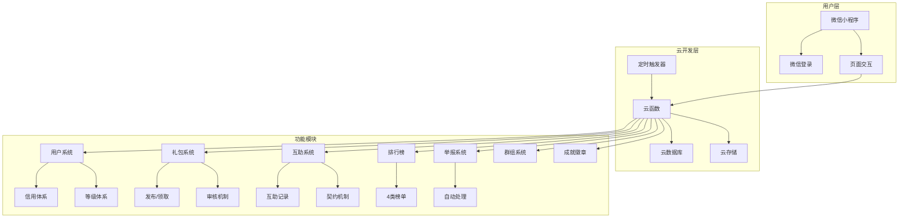
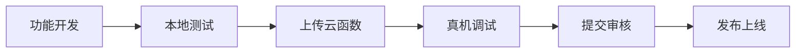

# 点点圈 DotCircle - AI 上下文指南

> **项目定位**: 纯公益的腾讯元宝抽奖互助平台，通过微信小程序和微信云开发实现
> 
> **核心理念**: 先助人，后受助。信用越好，曝光越高。
> 
> **Last Updated**: 2026-02-02

---

## 🎯 项目概述

### 背景与痛点

腾讯元宝分享抽奖活动导致微信群刷屏严重：
1. 微信群刷屏严重，影响正常交流
2. 抽奖礼包领取率低
3. 缺乏有效的互助机制

### 解决方案

**点点圈** 提供结构化互助平台：
- 用户必须先帮助他人(领取2个礼包)，才能发布自己的礼包
- 信用体系确保良性生态(60分起步，满分100)
- 曝光机制激励高质量互助(信用等级权重2.0x-0.5x)

### 核心机制流程

```
用户进入平台
    ↓
领取2个他人礼包（完成互助任务）
    ↓
获得发布资格
    ↓
发布自己的礼包
    ↓
其他用户领取，完成闭环
```

---

## 🏗️ 系统架构

### 整体架构图



### 技术栈

| 层级 | 技术 | 说明 |
|------|------|------|
| 前端 | 微信小程序原生框架 | WXML + WXSS + JS |
| 后端 | 微信云开发 | 云函数 + 云数据库 + 云存储 |
| 数据库 | MongoDB | 微信云开发数据库 |
| 存储 | 云存储 | 图片等静态资源 |
| 触发器 | 定时触发器 | 定时任务处理 |

---

## 📁 目录结构

```
AI-DotCircle/
├── CLAUDE.md                    # 本文件 - 根级AI上下文
├── DEVELOPMENT.md               # 开发文档
├── miniprogram/                 # 小程序前端
│   ├── CLAUDE.md               # 小程序模块文档
│   ├── pages/                  # 页面目录
│   ├── components/             # 组件目录
│   ├── utils/                  # 工具函数
│   └── app.js/app.json         # 入口配置
├── cloudfunctions/             # 云函数后端
│   ├── CLAUDE.md              # 云函数模块文档
│   ├── login/                 # 登录云函数
│   ├── user/                  # 用户相关
│   ├── packages/              # 礼包相关
│   ├── help/                  # 互助相关
│   ├── credit/                # 信用相关
│   ├── report/                # 举报相关
│   ├── leaderboard/           # 排行榜
│   ├── groups/                # 群组
│   ├── admin/                 # 管理后台
│   ├── cleanup/               # 定时清理
│   ├── updateLeaderboard/     # 定时更新榜单
│   ├── contractCheck/         # 契约检查
│   └── reportProcessor/       # 举报处理
└── prototype/                  # 原型设计
    └── prototype1.html        # UI原型
```

---

## 🔗 模块索引

### 前端模块

| 模块 | 路径 | 说明 | 状态 |
|------|------|------|------|
| 首页 | `miniprogram/pages/index/` | 礼包列表、曝光排序 | P0 |
| 发布页 | `miniprogram/pages/publish/` | 发布礼包(链接/图片) | P0 |
| 礼包详情 | `miniprogram/pages/package/detail/` | 礼包详情、帮助按钮 | P0 |
| 我的页面 | `miniprogram/pages/my/` | 个人中心、今日任务 | P0 |
| 分享管理 | `miniprogram/pages/my/packages/` | 管理我的分享(取消/更正) | P0 |
| 信用记录 | `miniprogram/pages/credit/history/` | 信用分变动记录 | P1 |
| 排行榜 | `miniprogram/pages/leaderboard/` | 4类榜单展示 | P1 |
| 举报页 | `miniprogram/pages/report/` | 提交举报 | P1 |
| 群组 | `miniprogram/pages/groups/` | 群组列表/详情 | P2 |
| 规则说明 | `miniprogram/pages/rules/` | 信用规则/教程 | P1 |

### 后端模块

| 模块 | 路径 | 说明 | 触发方式 |
|------|------|------|----------|
| 登录 | `cloudfunctions/login/` | 用户登录/注册 | HTTP |
| 用户 | `cloudfunctions/user/` | 用户信息/设置 | HTTP |
| 礼包 | `cloudfunctions/packages/` | 礼包CRUD | HTTP |
| 互助 | `cloudfunctions/help/` | 帮助操作 | HTTP |
| 信用 | `cloudfunctions/credit/` | 信用分操作 | HTTP |
| 举报 | `cloudfunctions/report/` | 举报处理 | HTTP |
| 排行榜 | `cloudfunctions/leaderboard/` | 榜单查询 | HTTP |
| 群组 | `cloudfunctions/groups/` | 群组操作 | HTTP |
| 管理 | `cloudfunctions/admin/` | 后台管理 | HTTP |
| 清理 | `cloudfunctions/cleanup/` | 数据清理 | Timer |
| 榜单更新 | `cloudfunctions/updateLeaderboard/` | 更新榜单 | Timer |
| 契约检查 | `cloudfunctions/contractCheck/` | 契约履约检查 | Timer |
| 举报处理 | `cloudfunctions/reportProcessor/` | 自动处理举报 | Timer |

---

## 📊 数据库集合

| 集合名 | 用途 | 预估数据量 | 关键索引 |
|--------|------|------------|----------|
| `users` | 用户数据 | 10万+ | _openid(唯一) |
| `packages` | 礼包数据 | 100万+ | creatorOpenid, status, createdAt |
| `helpRecords` | 帮助记录 | 1000万+ | packageId, helperOpenid |
| `reports` | 举报数据 | 10万+ | targetId, status, createdAt |
| `creditHistory` | 信用记录 | 1000万+ | _openid, timestamp |
| `groups` | 群组数据 | 1000+ | creatorOpenid |
| `groupMembers` | 群组成员 | 5万+ | groupId, userOpenid |
| `leaderboards` | 排行榜 | 4条/次 | type, period |
| `systemConfig` | 系统配置 | 1条 | _id |
| `adminLogs` | 管理员日志 | 10万+ | adminOpenid, timestamp |

---

## 🎨 全局约定

### 命名规范

```javascript
// 变量：camelCase
let userInfo = {}
let creditScore = 60
let isActive = true

// 常量：UPPER_SNAKE
const MAX_HELP = 10
const DEFAULT_CREDIT = 60
const PACKAGE_STATUS = {
  PENDING: 'pending',
  ACTIVE: 'active',
  COMPLETED: 'completed',
  EXPIRED: 'expired',
  REJECTED: 'rejected',
  CANCELLED: 'cancelled'
}

// 函数：camelCase，动词开头
function getUserInfo() {}
function handleSubmit() {}
function calculateExposure() {}

// 文件：kebab-case
// pages/user-profile/index.js
// cloudfunctions/update-credit/index.js

// 集合：小写复数
// users, packages, helpRecords
```

### 响应格式

```javascript
// 统一API响应格式
{
  success: true/false,
  code: 200/400/401/403/404/500,
  message: '错误信息',
  data: {}
}
```

### 错误码定义

| Code | 含义 | 使用场景 |
|------|------|----------|
| 200 | 成功 | 正常响应 |
| 400 | 请求参数错误 | 参数缺失/格式错误 |
| 401 | 未登录 | 需要登录 |
| 403 | 权限不足 | 操作无权限 |
| 404 | 资源不存在 | 数据未找到 |
| 429 | 频率限制 | 操作过于频繁 |
| 500 | 服务器错误 | 内部错误 |

### 信用等级体系

| 等级 | 分数 | 名称 | 每日额度 | 曝光权重 | 标识 | 特权 |
|------|------|------|----------|----------|------|------|
| 🏆 | 90-100 | 优秀 | 3个 | 2.0x | 金色 | 免审+置顶 |
| ⭐ | 75-89 | 良好 | 2个 | 1.5x | 银色 | 免审核 |
| 🔹 | 60-74 | 一般 | 2个 | 1.0x | 蓝色 | 需审核 |
| ⚠️ | 40-59 | 警告 | 1个 | 0.5x | 橙色 | 需审核 |
| 🚫 | 20-39 | 受限 | 0个 | 0x | 灰色 | 禁止发布 |
| ❌ | 0-19 | 封禁 | 0个 | 0x | 红色 | 禁止登录 |

---

## 🔧 开发工作流

### 标准开发流程



### 云函数部署

```bash
# 上传单个云函数
npx wxcloud deploy -e <env-id> -p cloudfunctions/login

# 上传所有云函数
npx wxcloud deploy -e <env-id> -p cloudfunctions/
```

### 数据库操作

```javascript
// 标准查询示例
const db = wx.cloud.database()

// 查询活跃用户
const { data } = await db.collection('users')
  .where({
    creditScore: db.command.gte(60),
    'dailyStats.date': '2026-02-02'
  })
  .orderBy('creditScore', 'desc')
  .limit(20)
  .get()
```

---

## 📖 参考文档

### 微信官方文档
- [小程序开发指南](https://developers.weixin.qq.com/miniprogram/dev/framework/)
- [云开发文档](https://developers.weixin.qq.com/miniprogram/dev/wxcloud/basis/getting-started.html)
- [云函数文档](https://developers.weixin.qq.com/miniprogram/dev/wxcloud/guide/functions.html)
- [数据库文档](https://developers.weixin.qq.com/miniprogram/dev/wxcloud/guide/database.html)

### 项目文档
- [DEVELOPMENT.md](./DEVELOPMENT.md) - 完整开发文档
- [miniprogram/CLAUDE.md](./miniprogram/CLAUDE.md) - 小程序模块指南
- [cloudfunctions/CLAUDE.md](./cloudfunctions/CLAUDE.md) - 云函数模块指南

---

## 🤖 AI 辅助开发提示

### 代码生成原则

1. **安全优先**: 所有敏感操作必须验证权限
2. **性能优化**: 数据库查询使用索引，避免全表扫描
3. **错误处理**: 完整的try-catch和错误日志
4. **数据校验**: 所有输入数据必须校验
5. **缓存策略**: 合理使用本地缓存减少请求

### 常见开发任务

**添加新页面：**
- 在 `miniprogram/pages/` 创建页面目录
- 配置 `app.json` pages数组
- 遵循现有页面结构和样式规范

**添加新云函数：**
- 在 `cloudfunctions/` 创建函数目录
- 使用 `index.js` + `config.json` 标准结构
- 配置定时触发器(如有需要)
- 更新本文件模块索引

**修改数据库Schema：**
- 更新 DEVELOPMENT.md 中的Schema定义
- 创建索引优化查询
- 确保向后兼容

---

## 🔄 更新日志

| 日期 | 版本 | 更新内容 |
|------|------|----------|
| 2026-02-02 | v1.0.0 | 初始创建，包含完整项目上下文 |

---

## 👥 团队规范

### 提交规范

```
feat: 新功能
fix: 修复bug
docs: 文档更新
style: 代码格式(不影响功能)
refactor: 重构
test: 测试相关
chore: 构建/工具相关
```

### 代码审查清单

- [ ] 遵循命名规范
- [ ] 添加了必要的注释
- [ ] 处理了错误情况
- [ ] 验证了输入数据
- [ ] 考虑了性能影响
- [ ] 更新了相关文档

---

**← 返回项目根目录** | [DEVELOPMENT.md](./DEVELOPMENT.md) | [小程序模块 →](./miniprogram/CLAUDE.md)
